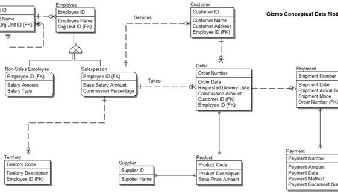

Title: Data Modelling
Date: 2016-09-05 10:20
Modified: 2016-09-05 19:30
Category: Data architecture
Tags: data modelling, data vault, erwin, powerdesigner, uml, relational, e-r
Slug: data-modelling
Authors: Deytalytics Ltd
Summary: This post covers the various data modelling techniques, methodologies and concepts that are in use today. It is not designed to teach data modelling but simply to provide brief statements of the purpose of different techniques and links to material which will provide further insight in to how to model data. There are plenty of online tutorials and youtube videos which will take you step by step through the modelling process.

## What is data modelling?
Data modelling is used to describe data objects (aka entities or tables), their attributes (aka fields or columns) and the relationships between them. It is important to do this so that you know what data needs to be stored for a particular purpose, and how relationships between that data should be enforced.

For example a customer sale, may involve:-

1. A customer entity

2. A sales order header entity

3. A sales order item entity.

The relationships between these entities may be:-

1. A customer can place 1 or more sales orders

2. A sales order contains 1 sales order header and 1 or more sales order items.

## What are the 3 common data modelling techniques?
1. The oldest way of modelling data object relationships is [hierarchical data modelling](https://en.wikipedia.org/wiki/Hierarchical_database_model). 
This was the most common data modelling technique in the 1970s when mainframe databases 
were in common use. This technique also had a revival when XML (1 of the main document integration formats) was introduced in the 1990s to allow documents to be shared between systems. In hierarchical data modelling, data is stored in a tree like structure e.g. for a customer sale, you might have customer as 1 entity and sales order header->sales order item as another entity with a link between the sales order header entity and the customer entity. 

2. In the 1980s, [entity-relationship data modelling (ER-modelling)](https://en.wikipedia.org/wiki/Entity%E2%80%93relationship_model) became common as relational databases e.g. Oracle, DB2, Sybase became more common. This remains by far the most common method of modelling data today, and is typically used for online transaction processing and data warehousing applications. In the customer sale problem, you have 3 entities - a customer, a sales order header and a sales order item. A customer can be associated to 1 or more sales order headers. A sales order header can have 1 or more sales order items.

3. In the 1990s, as object-orientated progamming e.g. C++, Java became popular within 
application developers, there was a need to store data in the same way as the application 
held data in memory. [Universal Modelling Language (UML) modelling](https://en.wikipedia.org/wiki/Unified_Modeling_Language) was introduced to meet this need with the class diagram concept of most use to data architects. This remains little used in practice, however, due to the lack of popularity of object-orientated databases and application developers using other techniques to quickly store data e.g. in JSON objects nowadays. In the customer sale problem, the class diagram would have classes for customer and sales order and sales order item.

The main differences between a class diagram and an E-R diagram are that a class diagram can:-

* Describe the allowable operations that can be applied to the class e.g. registerCustomer, createSalesOrderHeader, readSalesOrderHeader etc.
 
* Can use more sophisticated relationships. For example, in an E-R diagram, there is no differentiation between the way that you model "a customer can place 1 or more sales orders" (2 distinctly different entities) and "a team is made up of 1 or more people (team is simply an aggregate of people). Similarly E-R modelling doesn't  model composition objects e.g. a car is made up of 1 steering wheel, a body shell, x doors, x wheels etc. 
 

## What are the 3 common data modelling methodologies used in E-R modelling?
1. The oldest method of storing data in a relational database was developed by E.F. Codd 
and focuses on ensuring that data is physically stored in as efficient method as possible. 
This methodology requires data to be stored in what is known as [3rd normal form (3NF)](https://en.wikipedia.org/wiki/Third_normal_form). 
A simple mantra "The key, the whole key and nothing but the key, so help me Codd" reminds 
the data modeller that a data object needs to have a set of attributes that can be uniquely 
identified by the whole primary key defined for that data object and is not dependent on 
other data attributes within the data object. A primary key is simply a field which 
uniquely identifies a particular instance of data object. For example, for a customer, 
a customer id would be a good primary key, so long as you truly uniquely identify a 
customer using it. You might think that a combination of customer first name and last name 
or their email address would make good primary keys but the drawbacks there are that 
people's names aren't particularly unique and a person can have more than 1 email address. 
Data is typically physically stored in 3NF in 
[online transaction processing (OLTP)](https://en.wikipedia.org/wiki/Online_transaction_processing) relational databases or in enterprise data warehouses that use the Bill Inmon approach.

2. The 2nd most common method of storing data in relational databases was developed by 
Ralph Kimball in the 1990s and is known as [dimensional modelling](https://en.wikipedia.org/wiki/Dimensional_modeling). It's typically used for 
data warehousing applications. The downside of efficiently storing data in 3NF is that 
querying data can become non-performant due to the extensive set of relationships that 
need to be navigated in order to join data between different data objects. 
Kimball's dimensional model stores transactions either at a granular or aggregated level 
in a central fact table, and reference data hierarchies that are used to dice, slice and 
aggregate the fact table at different levels are merged in to single tables (for each 
hierarchy) known as dimensions. By having a single central fact table joined directly to 
dimension tables, the number of joins required to retrieve data is dramatically reduced 
leading to much more performant queries. The downside of dimensional modelling is that 
data can be lost. For example, if you create a sales data model with customer, product 
and store as dimensions, then you would not be able to query products by store, 
where a product has yet to be sold. For most use cases, the advantage of performant 
queries overcomes any minor disadvantages that Kimball's technique incurs, however. 

3. An emerging data modelling methodology has been invented by Dan Linstadt and is known as [data vault modelling](https://en.wikipedia.org/wiki/Data_vault_modeling). 
One of the drawbacks of data modelling for a data warehouse is having to change the data model (and associated data integration scripts) as new data objects and relationships are discovered. Data vault modelling has a concept of:-

* A hub - which is a data object containing just the primary key information

* A satellite - which is a data object which contains all of the associated attributes

* A link - which is a data object which allows many to many relationships to be stored between 2 or more hub objects.
The advantage of data vault modelling is around it's flexibility. If new attributes need to be added, then you can create an additional satellite table. If new relationships need to be added, you can create a new link data object. If new data objects need to be added, you can create a new hub, satellite and link tables. The disadvantage of data vault modelling is that it leads to the creation of many more tables than you would using the 3NF approach, so is even less performant for actually querying the data. 

## What the 3 main levels of data modelling in use today?
1. A data modelling exercise typically starts with a conceptual data model. This is simply identifying key entities that are required to be stored and relationships between them without identifiying primary keys or attributes. 

2. Logical data modelling then fills in the primary keys, attributes and relationships. The logical data model most closely represents in totality a business analyst or SME's view as to how entities and their relationships work in the real world. 

3. Physical data modelling models data in a form that is relevant to a particular database management system. So will define specific datatypes, storage requirements and indexes, for example. It also resolves supertype/subtype and many to many relationships which appear in a logical data model but can't be physically accommodated in relational database management systems.

## What are the most popular data modelling tools used today?
Gartner hasn't covered data modelling tools for a number of years but the 3 choices that are most commonly made (not tied to a single database vendor), in my experience are:-

1. [Erwin](http://erwin.com/)
2. [SAP PowerDesigner](http://go.sap.com/uk/product/data-mgmt/powerdesigner-data-modeling-tools.html)
3. [ER/Studio](https://www.idera.com/er-studio-data-architect-software?utm_source=google&utm_medium=cpc&utm_campaign=emberstudio&utm_content=brand&gclid=cj0keqjwr7s-brd96_uw9jk8unabeiqaujbffams4poe6mowozdx0dvu9brjbmr69xi9odxyxyma-poaar2g8p8haq)

Other worthy candidates include:-

* If you're predominantly modelling SQL*Server databases, you'll likely do physical 
data modelling using [SQL*Server Management Studio](https://msdn.microsoft.com/en-us/library/ms188251.aspx) 

* For IBM DB2, [Infosphere Data Architect](http://www-03.ibm.com/software/products/en/ibminfodataarch) is a data modelling tool that IBM promote.

* For Oracle data modelling, [Oracle SQL Developer Data Modeller](http://www.oracle.com/technetwork/developer-tools/datamodeler/overview/index.html) is a popular free offering

* If you're working at the enterprise architecture level, then [Sparx EA](http://www.sparxsystems.com/products/ea/) is often chosen.

## Which data modelling notation should I use?
There are 4 common data modelling notations in use today. The easiest to understand is 
[Barker](https://en.wikipedia.org/wiki/Barker%27s_notation). 
[IE](https://www.eastcoastoracle.org/PDF_files/2011/Presentations/LurtonDatamodeling.pdf) 
& [IDEF1X](https://en.wikipedia.org/wiki/IDEF1X) are supported by most data modelling tools,
 and [UML](http://www.uml-diagrams.org/class-reference.html) is also quite common. 
 
 The diagram shows the way that various data modelling components are depicted using these notations:-

