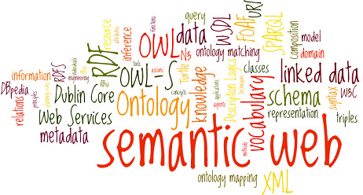

Title: What does the "Semantic Web" mean?
Date: 2016-10-27 10:20
Modified: 2016-10-27 19:30
Category: Data Architecture
Tags: semantic web, rdf, owl, web 3.0
Slug: semantic-web
Authors: Deytalytics Ltd
Summary: For a number of year's the concept of being able to strictly define and classify data in order to allow websites to be able to share data easily has been gaining ground. This concept is known as the "Semantic web". This post provides information about it and a basic description of the technologies used.

##History of Web Development
The first web sites consisted of static web pages developed in HTML stored on the web server. This is now referred to as Web 1.0

[Web 2.0](http://en.wikipedia.org/wiki/Web_2.0) is when dynamic content was added to web pages e.g. javascript, content was stored in content management systems rather than files, and web page functionality is controlled by services hosted on an application server. Web 2.0 incorporates video, adds social media buttons and allows a user to add their own content to a website e.g. by commenting on newspaper articles.

[Web 3.0](http://en.wikipedia.org/wiki/Semantic_Web) (aka the "Semantic Web") will allow websites to not only source their data content from back end databases owned by the website owner but will be able to reach out for data content from external data providers.

##Are Open API calls examples of the Semantic Web?
Not really. At the moment, a number of websites provide data via APIs. For example, a user can permit another website to access it's Facebook profile data, 
and the website can then use the
 [Facebook Graph API](http://developers.facebook.com/docs/graph-api) 
 to pull down the data. 
 The data retrieved can be either in [JSON](http://www.json.org/) or [XML](http://en.wikipedia.org/wiki/XML) format, both of which formalise the structure of the data, but not the meaning of the data. In order to understand the meaning of the data fields that are returned, a human being has to read the accompanying information. In order for a website to be able to read the Facebook Graph API, the website coder has to read the documentation, extract and integrate the data. With the Semantic Web, a website can ask for data from another website and due to the level of detail provided in the returned data file, the website should be able to work out the meaning of the data and extract those elements of the data that are relevant for it's use. 

##What technologies are used in the Semantic Web?
The most common technologies are the Resource Description Framework ([RDF](http://en.wikipedia.org/wiki/Resource_Description_Framework)) and the Web Ontology Language ([OWL](http://en.wikipedia.org/wiki/Web_Ontology_Language))

###RDF
RDF is a method by which you can define data objects within a web environment and how they relate to other data objects. If you're familiar with data modelling, RDF can provide you with an entity (subject), another entity (object) and the relationship between them (predicate). So a department employs employees has department as the subject, employs as the predicate and employee as the object, if you were to use it to describe part of an entity relationship diagram. 

Since RDF is designed to describe relationships between data objects in a web rather 
than database environment, it can reference distinct types of data objects, 
however e.g. web properties, classes, literals etc. It's this more ability to more 
precisely define different types of data objects, their properties, 
the relationship between them and range values which allows RDF to provide sufficient 
information that a machine can understand the data, rather than requiring human 
intervention.

In the same way that [XML Schema](http://en.wikipedia.org/wiki/XML_schema) can be used to specify the exact structure of an 
XML file which conforms to that schema, 
[RDF Schema](http://en.wikipedia.org/wiki/RDF_Schema) (RDFS) will describe the restricted set of subjects, predicates and objects 
that an RDF file can use.

###OWL
An Ontology is the way of defining the relationships between particular objects. For example. A bird is a type of animal. A turtle is a type of animal. A tortoise is similar to a turtle.

In the example, bird and turtle are defined as being instances (types of) animal. That kind of hierarchical classification is also known as a taxonomy. An ontology additionally allows to provide the "similar to" relationship, so is a more powerful way of describing all of the relationships between objects.

OWL uses RDF to define relationships between instances of data objects.

##Challenges in developing a semantic web
The main challenge will be in developing a common understanding as to how to define data 
objects which are universally accepted and dealing with multiple languages. It is hoped 
that in a similar way to how message format standards e.g. [SWIFT](http://en.wikipedia.org/wiki/ISO_9362) has developed for the banking industry, that definitions and classifications of data objects, their relationships and properties will emerge over time that will be relevant to small communities initially and then expand in scope.